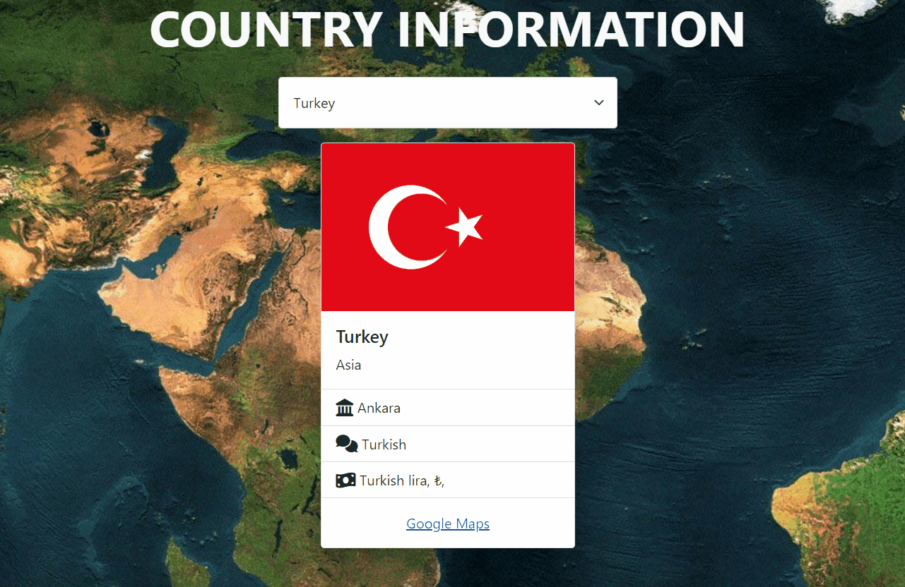
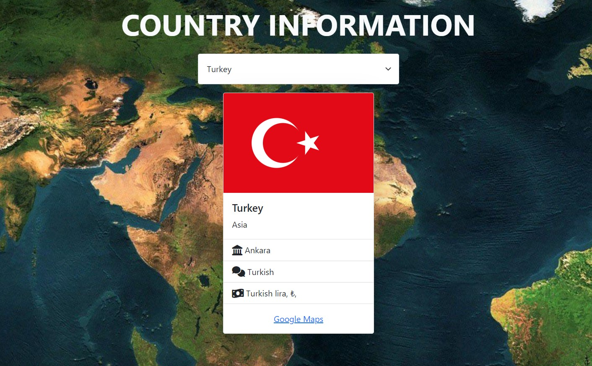

# Project : Country Flags Info
## Animation of the Website

## Visulation of the Website

## Description

Project aims get information about countries via a RESTful API

## Learning Outcomes

At the end of the this project, you will be able to;

- analyze a problem,

- demonstrate your knowledge of algorithmic design principles,

- get information about countries via a API.

## Project Skeleton 

|----CountryFlagsInfo

        |----index.html  
        |----script.js
        |----flag.gif
        |----flag.jpg
        |----img
        |----readme.md 

### Overview
I mastered HTML, CSS and Javascript fetch API features in this project. You can see the visual representation of the website above.

🔥 You can use [REST COUNTRIES API ](https://restcountries.com/) for your app. 

